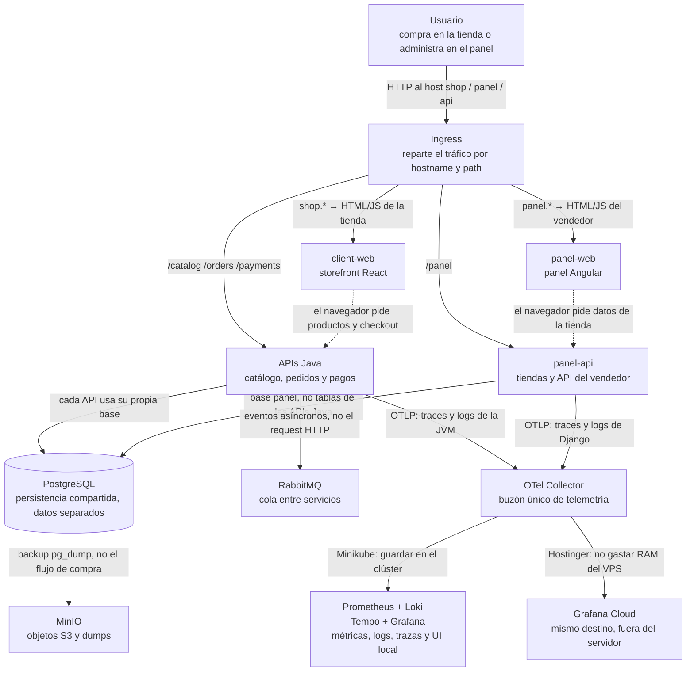

# Stack tecnológico

Inventario de las tecnologías presentes en Friendly E-Shop: para qué está cada una y dónde consultar su documentación oficial.

El diseño original se discutió en [Diseñar Friendly E-Shop](https://chatgpt.com/share/6aaecb01-a7a0-83e9-8294-876d3593a6dc). Este archivo documenta lo que el repositorio **implementa hoy**, no el backlog diferido de esa conversación.

Las versiones se toman de `pom.xml`, `package.json`, `requirements.txt`, Dockerfiles, manifiestos de Kubernetes, Terraform y el registro de validación en [`validation.md`](validation.md).

## Vista general

Cómo se conectan las piezas en runtime. Cada caja es el rol en *este* proyecto; cada flecha dice por qué hablan. El inventario con versiones está más abajo.

Flechas sólidas = tráfico o datos en el camino principal. Punteadas = el SPA llama a la API desde el browser, o un job de backup.

Todo esto corre en Kubernetes (Minikube local / K3s en Hostinger). Kustomize elige las diferencias de ambiente. Terraform solo crea el VPS, no el tráfico de la tienda.

## Cómo está organizado el repositorio

| Proyecto | Responsabilidad |
|---|---|
| `catalog-api` | Productos, precios y stock inicial |
| `order-api` | Pedidos y estado de compra acordado |
| `payment-api` | Intentos de pago e idempotencia |
| `panel-api` | Tiendas y API del panel; no escribe tablas de los otros servicios |
| `client-web` | Storefront público |
| `panel-web` | Administración del vendedor |
| `infra` | Kubernetes, Kustomize, Terraform, imágenes de plataforma y scripts operativos |

Los recursos de Kubernetes se separan en los namespaces `apps`, `platform` y `observability`. Minikube corre el stack LGTM completo. Hostinger deja solo el OpenTelemetry Collector y exporta telemetría a Grafana Cloud.

---

## Lenguajes y runtimes

| Tecnología | Versión | Función en este proyecto | Documentación |
|---|---|---|---|
| **Java** | 25 LTS (`java.version` en los `pom.xml`) | Lenguaje de `catalog-api`, `order-api` y `payment-api` | [Java 25](https://docs.oracle.com/en/java/javase/25/) |
| **Eclipse Temurin** | JRE `25.0.4_7` sobre Ubuntu Noble; imagen de build `maven:3.9.16-eclipse-temurin-25-noble` | Compila y ejecuta los JAR de Spring Boot | [Adoptium / Temurin](https://adoptium.net/docs/) |
| **Python** | `3.14.7` (`python:3.14.7-slim-trixie`) | Runtime de `panel-api` | [Python 3.14](https://docs.python.org/3.14/) |
| **TypeScript** | `5.9.3` | Tipado de `client-web` y `panel-web` | [TypeScript](https://www.typescriptlang.org/docs/) |
| **Node.js** | `24.21.0-alpine3.24` | `npm ci` y builds de Vite / Angular | [Node.js 24](https://nodejs.org/docs/latest-v24.x/api/) |
| **Go** | `1.24.8-bookworm` | Compila el binario de MinIO desde el tag fijado | [Go](https://go.dev/doc/) |
| **Bash** | `/usr/bin/env bash` | Scripts de `infra/scripts` y el `Makefile` | [Bash](https://www.gnu.org/software/bash/manual/bash.html) |
| **SQL** (dialecto PostgreSQL) | migraciones Flyway y Django | DDL de `products`, `orders`, `payment_attempts` y el modelo `Shop` | [SQL de PostgreSQL](https://www.postgresql.org/docs/18/sql.html) |

---

## Frameworks de aplicación

| Tecnología | Versión | Función en este proyecto | Documentación |
|---|---|---|---|
| **Spring Boot** | `4.1.1` (BOM padre) | Arranque, configuración, Actuator, JPA y AMQP de las tres APIs Java | [Spring Boot](https://docs.spring.io/spring-boot/) |
| **Spring Web** (`spring-boot-starter-web`) | via Boot `4.1.1` | Controladores HTTP en `/catalog`, `/orders` y `/payments` | [Spring Web MVC](https://docs.spring.io/spring-framework/reference/web/webmvc.html) |
| **Apache Tomcat** (embebido) | el que trae Spring Boot Web | Servidor HTTP del JAR ejecutable | [Apache Tomcat](https://tomcat.apache.org/tomcat-11.0-doc/) |
| **Jackson** | el que trae Spring Boot Web | Serialización JSON de las respuestas REST | [Jackson](https://github.com/FasterXML/jackson-docs) |
| **Spring Data JPA** | via Boot `4.1.1` | Capa de persistencia; `ddl-auto: validate` contra el esquema migrado | [Spring Data JPA](https://docs.spring.io/spring-data/jpa/reference/) |
| **Hibernate ORM** | el que trae Spring Data JPA | ORM detrás de JPA | [Hibernate ORM](https://docs.jboss.org/hibernate/orm/current/userguide/html_single/Hibernate_User_Guide.html) |
| **Spring AMQP** (`spring-boot-starter-amqp`) | via Boot `4.1.1` | Cliente RabbitMQ (host, vhost y credenciales) preparado para eventos asíncronos | [Spring AMQP](https://docs.spring.io/spring-amqp/reference/) |
| **Spring Boot Actuator** | via Boot `4.1.1` | Probes `/actuator/health/*` y métricas `/actuator/prometheus` | [Actuator](https://docs.spring.io/spring-boot/reference/actuator/index.html) |
| **Django** | `5.2.17` LTS | Settings, modelos, migraciones, health checks y WSGI de `panel-api` | [Django 5.2](https://docs.djangoproject.com/en/5.2/) |
| **Django REST Framework** | `3.18.1` | API REST del panel; renderer JSON por defecto | [Django REST Framework](https://www.django-rest-framework.org/) |
| **Django WSGI** | `config.wsgi:application` | Punto de entrada que consume Gunicorn | [Cómo desplegar Django](https://docs.djangoproject.com/en/5.2/howto/deployment/wsgi/) |
| **React** | `19.3.0` (+ `react-dom` `19.3.0`) | UI del storefront público | [React](https://react.dev/) |
| **Angular** | paquetes `21.2.23`; CLI / builder `21.2.24` | UI standalone del panel de vendedor | [Angular](https://angular.dev/) |
| **RxJS** | `7.8.2` | Dependencia de Angular para programación reactiva | [RxJS](https://rxjs.dev/) |

`django.contrib.auth` y `django.contrib.contenttypes` están instalados para el modelo de membresías de tienda. `SecurityMiddleware` y `CommonMiddleware` cubren cabeceras de seguridad y normalización HTTP. `SECURE_PROXY_SSL_HEADER` hace que Django confíe en `X-Forwarded-Proto` detrás del Ingress con TLS.

---

## Persistencia

La conversación de diseño pidió **una instancia PostgreSQL con bases y usuarios separados por servicio**, para no compartir tablas entre bounded contexts. MinIO cubre almacenamiento de objetos compatible con S3 (hoy, backups; más adelante, imágenes de producto).

| Tecnología | Versión | Función en este proyecto | Documentación |
|---|---|---|---|
| **PostgreSQL** | `postgres:18.4-alpine3.24` | Única instancia; bases `catalog`, `orders`, `payments` y `panel` con usuarios propios | [PostgreSQL 18](https://www.postgresql.org/docs/18/) |
| **PostgreSQL JDBC** | driver `org.postgresql:postgresql` (BOM de Spring) | Conexión `jdbc:postgresql://...` desde las APIs Java | [PostgreSQL JDBC](https://jdbc.postgresql.org/documentation/) |
| **JDBC** | API de Java SE | Contrato de acceso SQL usado por Spring / Hibernate | [JDBC](https://docs.oracle.com/en/java/javase/25/docs/api/java.sql/java/sql/package-summary.html) |
| **psycopg** (binario) | `3.3.6` (`psycopg[binary]`) | Driver PostgreSQL de Django | [psycopg 3](https://www.psycopg.org/psycopg3/docs/) |
| **Flyway** | `flyway-core` + `flyway-database-postgresql` (BOM de Spring) | Migraciones SQL al arrancar las APIs Java (`V1__*.sql`) | [Flyway](https://documentation.red-gate.com/flyway) |
| **Migraciones de Django** | `0001_initial` | Tabla del modelo `Shop`; se aplican en un initContainer `manage.py migrate` | [Migraciones de Django](https://docs.djangoproject.com/en/5.2/topics/migrations/) |
| **MinIO** | `RELEASE.2025-10-15T17-29-55Z` (imagen compilada en `infra/images/minio`) | Object storage S3-compatible; bucket `backups`; consola en `:9001` | [MinIO](https://min.io/docs/minio/linux/index.html) |
| **API S3** | protocolo de MinIO | Interfaz portable de objetos (la conversación la eligió para no acoplarse a un cloud) | [API S3](https://docs.aws.amazon.com/AmazonS3/latest/API/Welcome.html) |
| **`pg_dump` / `pg_restore`** | herramientas de la imagen PostgreSQL; formato custom `-Fc` | Backup y restore por base hacia/desde MinIO | [pg_dump](https://www.postgresql.org/docs/18/app-pgdump.html) · [pg_restore](https://www.postgresql.org/docs/18/app-pgrestore.html) |
| **`pg_isready`** | cliente PostgreSQL | Probes de liveness/readiness del StatefulSet | [pg_isready](https://www.postgresql.org/docs/18/app-pg-isready.html) |
| **PersistentVolumeClaim** | 10 Gi PostgreSQL/MinIO, 5 Gi RabbitMQ, `ReadWriteOnce` | Disco durable de la plataforma | [Volúmenes persistentes](https://kubernetes.io/docs/concepts/storage/persistent-volumes/) |
| **emptyDir** | volúmenes efímeros | `/tmp` de las apps y datos locales de Prometheus, Loki, Tempo y Grafana | [emptyDir](https://kubernetes.io/docs/concepts/storage/volumes/#emptydir) |
| **MinIO Client (`mc`)** | CLI del Brewfile | `alias`, `mb`, `pipe`, `cat` y `ls` en los scripts de backup | [mc](https://min.io/docs/minio/linux/reference/minio-mc.html) |

El script de init de PostgreSQL (`01-create-databases.sh`) crea usuarios y bases al primer arranque. Hibernate **no** crea esquema: solo valida el que Flyway ya migró.

---

## Mensajería

La conversación eligió **RabbitMQ desde el primer flujo asíncrono** y dejó Kafka para una etapa posterior. Las APIs Java ya tienen cliente y configuración; todavía no publican ni consumen mensajes.

| Tecnología | Versión | Función en este proyecto | Documentación |
|---|---|---|---|
| **RabbitMQ** | `rabbitmq:4.2.9-management-alpine` | Broker AMQP; usuario `app`, vhost `friendly`; UI de management en `:15672` | [RabbitMQ](https://www.rabbitmq.com/docs) |
| **AMQP 0-9-1** | puerto `5672` | Protocolo de colas usado por Spring AMQP | [AMQP 0-9-1](https://www.rabbitmq.com/docs/amqp) |
| **RabbitMQ Management Plugin** | incluido en el tag `-management` | Consola HTTP interna (port-forward, no Ingress) | [Management](https://www.rabbitmq.com/docs/management) |
| **`rabbitmq-diagnostics`** | CLI de la imagen | Probes `ping` / `check_running` del StatefulSet | [rabbitmq-diagnostics](https://www.rabbitmq.com/docs/cli) |

---

## Observabilidad

La conversación pidió instrumentar desde la primera funcionalidad con OpenTelemetry y el stack LGTM (Loki, Grafana, Tempo, Prometheus), en lugar de Elasticsearch solo para logs. En Minikube el stack corre dentro del clúster. En Hostinger solo queda el Collector, que exporta a Grafana Cloud para no gastar RAM del VPS.

| Tecnología | Versión | Función en este proyecto | Documentación |
|---|---|---|---|
| **OpenTelemetry** | protocolo OTLP `http/protobuf` hacia `:4318` | Instrumentación, contexto y correlación entre servicios | [OpenTelemetry](https://opentelemetry.io/docs/) |
| **OTLP** | gRPC `:4317` y HTTP `:4318` | Cable de traces, métricas y logs hacia el Collector | [Especificación OTLP](https://opentelemetry.io/docs/specs/otlp/) |
| **OpenTelemetry Java Agent** | `2.31.1` (SHA-256 fijado en el Dockerfile) | Auto-instrumentación JVM con `-javaagent`; no exporta métricas OTLP (`OTEL_METRICS_EXPORTER=none`) porque Prometheus scrapea Actuator | [Java Agent](https://opentelemetry.io/docs/zero-code/java/agent/) |
| **OpenTelemetry Distro (Python)** | `0.65b0` | Wrapper `opentelemetry-instrument` delante de Gunicorn | [Zero-code Python](https://opentelemetry.io/docs/zero-code/python/) |
| **OTLP Exporter (Python)** | `1.44.0` | Exporta traces y logs al Collector | [OTLP Exporter Python](https://opentelemetry-python.readthedocs.io/en/latest/exporter/otlp/otlp.html) |
| **OTEL instrumentation Django** | `0.65b0` | Spans de requests Django | [opentelemetry-instrumentation-django](https://opentelemetry-python-contrib.readthedocs.io/en/latest/instrumentation/django/django.html) |
| **OTEL instrumentation logging** | `0.65b0` | Correlación de logs (`OTEL_LOGS_EXPORTER=otlp`) | [opentelemetry-instrumentation-logging](https://opentelemetry-python-contrib.readthedocs.io/en/latest/instrumentation/logging/logging.html) |
| **OTEL instrumentation psycopg** | `0.65b0` | Spans de consultas SQL de Django | [opentelemetry-instrumentation-psycopg](https://opentelemetry-python-contrib.readthedocs.io/en/latest/instrumentation/psycopg/psycopg.html) |
| **OpenTelemetry Collector Contrib** | `otel/opentelemetry-collector-contrib:0.161.0` | Recibe OTLP, aplica `memory_limiter`, `resource` y `batch`, y exporta según el overlay | [Collector](https://opentelemetry.io/docs/collector/) |
| **Micrometer** | `micrometer-registry-prometheus` (BOM de Spring) | Expone métricas JVM/HTTP en `/actuator/prometheus` | [Micrometer Prometheus](https://docs.micrometer.io/micrometer/reference/implementations/prometheus.html) |
| **Prometheus** | `prom/prometheus:v3.14.0` | Scrapea el Collector (`:8888`, `:8889`) y las APIs Java; retención 24 h (solo Minikube) | [Prometheus](https://prometheus.io/docs/prometheus/latest/) |
| **Grafana Loki** | `grafana/loki:3.7.8` | Almacén de logs; ingest OTLP desde el Collector; schema TSDB v13; retención 24 h (solo Minikube) | [Loki](https://grafana.com/docs/loki/latest/) |
| **Grafana Tempo** | `grafana/tempo:2.9.0` | Almacén de trazas; OTLP gRPC/HTTP; retención de bloques 24 h (solo Minikube) | [Tempo](https://grafana.com/docs/tempo/latest/) |
| **Grafana** | `grafana/grafana:13.2.2` | UI local; datasources Prometheus/Loki/Tempo; dashboard *Friendly E-Shop Overview* | [Grafana](https://grafana.com/docs/grafana/latest/) |
| **Grafana provisioning** | datasources y dashboards en ConfigMaps | Carga automática de Prometheus, Loki, Tempo y el dashboard de overview | [Provisioning](https://grafana.com/docs/grafana/latest/administration/provisioning/) |
| **Grafana Cloud** | endpoint OTLP + header `Authorization: Basic …` | Destino de traces, métricas y logs en el overlay Hostinger | [Grafana Cloud OTLP](https://grafana.com/docs/grafana-cloud/send-data/otlp/) |
| **Kubernetes Metrics Server** | addon de Minikube | Métricas de CPU/memoria de pods y nodos en el clúster local | [metrics-server](https://github.com/kubernetes-sigs/metrics-server) |

Pipelines del Collector:

- **Minikube:** traces → Tempo, métricas → exporter Prometheus `:8889`, logs → Loki.
- **Hostinger:** traces, métricas y logs → `otlp_http/grafana`.
- **Base:** exporters `debug` (plantilla; los overlays la reemplazan).

Las APIs Java anotan pods con `prometheus.io/scrape` para el job `java-services`. El dashboard local grafica `http_server_requests_seconds_count`, `jvm_memory_used_bytes` y logs `{service_namespace="friendly-e-shop"}`. Tempo está cableado a Loki (`tracesToLogsV2`) y a Prometheus (`serviceMap`).

---

## Infraestructura y orquestación

La conversación separó responsabilidades: **Kustomize configura lo que vive dentro de Kubernetes**; **Terraform crea el VPS, red y bootstrap**. El primer entorno ejecutable es Minikube; Hostinger es un overlay K3s de un nodo, no HA.

| Tecnología | Versión | Función en este proyecto | Documentación |
|---|---|---|---|
| **Kubernetes** | Minikube validado con `1.37.0`; K3s `v1.35.2+k3s1` | Orquestación de Deployments, Services, StatefulSets, Ingress, probes y límites | [Kubernetes](https://kubernetes.io/docs/home/) |
| **Minikube** | validado `1.39.0`; perfil `friendly-e-shop`; driver Docker; 6 CPU / 8 GiB por defecto | Clúster local completo (apps + plataforma + LGTM) | [Minikube](https://minikube.sigs.k8s.io/docs/) |
| **minikube tunnel** | driver Docker en macOS | Expone LoadBalancer/Ingress en `127.0.0.1` | [Acceso LoadBalancer](https://minikube.sigs.k8s.io/docs/handbook/accessing/) |
| **K3s** | `v1.35.2+k3s1` con `--secrets-encryption` | Kubernetes liviano de un nodo en el VPS Hostinger | [K3s](https://docs.k3s.io/) |
| **Kustomize** | CLI del Brewfile | Base + overlays `minikube` / `hostinger` (imágenes, Ingress, secretos, OTEL) | [Kustomize](https://kubernetes.io/docs/tasks/manage-kubernetes-objects/kustomization/) |
| **Docker** | Docker Desktop (driver de Minikube y builds) | Imágenes multi-stage de las seis apps y MinIO | [Docker](https://docs.docker.com/) |
| **Builds multi-stage** | Dockerfiles de cada app | Separa compile (Maven/Node/Go) del runtime mínimo | [Multi-stage builds](https://docs.docker.com/build/building/multi-stage/) |
| **Terraform** | `= 1.16.3` | IaC del VPS Hostinger, SSH y script post-install; `apply` no corre en el bootstrap | [Terraform](https://developer.hashicorp.com/terraform/docs) |
| **Provider Hostinger** | `hostinger/hostinger` `= 0.1.23` | Recurso de VPS, llave SSH y script de bootstrap K3s | [Provider Hostinger](https://registry.terraform.io/providers/hostinger/hostinger/latest/docs) |
| **Hostinger VPS** | plantilla (provisioning desactivado por defecto) | Destino público de un nodo en Brasil; `prevent_destroy` para no cancelar la suscripción por error | [VPS Hostinger](https://www.hostinger.com/tutorials/vps) |
| **Ubuntu LTS** | template_id del VPS (placeholder) | Sistema operativo del servidor Hostinger | [Ubuntu Server](https://documentation.ubuntu.com/server/) |
| **Namespaces** | `apps`, `platform`, `observability` | Aislamiento lógico; Pod Security `baseline` | [Namespaces](https://kubernetes.io/docs/concepts/overview/working-with-objects/namespaces/) |
| **Deployment** | `apps/v1` | Workloads stateless de las seis apps y del stack de observabilidad | [Deployment](https://kubernetes.io/docs/concepts/workloads/controllers/deployment/) |
| **StatefulSet** | PostgreSQL, RabbitMQ, MinIO | Identidad estable y PVC para datos | [StatefulSet](https://kubernetes.io/docs/concepts/workloads/controllers/statefulset/) |
| **Service** | ClusterIP / headless | DNS interno (`*.svc.cluster.local`) | [Service](https://kubernetes.io/docs/concepts/services-networking/service/) |
| **initContainer** | `migrate` en `panel-api` | Aplica migraciones Django antes de levantar Gunicorn | [Init Containers](https://kubernetes.io/docs/concepts/workloads/pods/init-containers/) |
| **Probes** | startup / readiness / liveness | Health de apps, PostgreSQL, RabbitMQ y Collector | [Probes](https://kubernetes.io/docs/tasks/configure-pod-container/configure-liveness-readiness-startup-probes/) |
| **Resource requests/limits** | CPU/RAM por contenedor | Evita que un servicio ahogue al nodo único | [Resource management](https://kubernetes.io/docs/concepts/configuration/manage-resources-containers/) |
| **GHCR** | tags `0.1.0` (owner placeholder) | Registry de imágenes para Hostinger, elegido por ser cloud-agnostic | [GitHub Container Registry](https://docs.github.com/en/packages/working-with-a-github-packages-registry/working-with-the-container-registry) |
| **Helm** | CLI del Brewfile | Instalado por `make bootstrap`; **los manifiestos no usan charts** (se despliega con Kustomize) | [Helm](https://helm.sh/docs/) |

`enable_vps_provisioning` queda en `false`: un `apply` con el recurso habilitado puede comprar VPS; un destroy puede cancelar la suscripción.

---

## Redes, ingreso y TLS

| Tecnología | Versión / detalle | Función en este proyecto | Documentación |
|---|---|---|---|
| **Ingress** | hosts `shop`, `panel`, `api` (y `grafana` en Minikube); paths `/catalog`, `/orders`, `/payments`, `/panel` | Enrutado HTTP público por host y path | [Ingress](https://kubernetes.io/docs/concepts/services-networking/ingress/) |
| **Ingress NGINX** | addon `ingress` de Minikube (`ingressClassName: nginx`) | Controlador de ingreso local | [ingress-nginx](https://kubernetes.github.io/ingress-nginx/) |
| **Traefik** | el que trae K3s (`ingressClassName: traefik`) | Controlador de ingreso en Hostinger | [Traefik Kubernetes Ingress](https://doc.traefik.io/traefik/providers/kubernetes-ingress/) |
| **NetworkPolicy** | API `networking.k8s.io` | Restringe tráfico hacia plataforma, observabilidad y apps | [NetworkPolicy](https://kubernetes.io/docs/concepts/services-networking/network-policies/) |
| **cert-manager** | CRD `ClusterIssuer` `letsencrypt-prod` | Emite certificados TLS en Hostinger | [cert-manager](https://cert-manager.io/docs/) |
| **Let’s Encrypt** | ACME `https://acme-v02.api.letsencrypt.org/directory` | CA pública de los certificados de producción | [Let’s Encrypt](https://letsencrypt.org/docs/) |
| **ACME HTTP-01** | solver `ingressClassName: traefik` | Prueba de control del dominio para el certificado | [HTTP-01](https://letsencrypt.org/docs/challenge-types/#http-01-challenge) |
| **TLS Secret** | `friendly-e-shop-tls` | Certificado servido por el Ingress de Hostinger | [Ingress TLS](https://kubernetes.io/docs/concepts/services-networking/ingress/#tls) |
| **DNS** | registros A hacia el IPv4 del VPS (manual) | `shop`, `panel` y `api` del dominio real | ver [`hostinger.md`](hostinger.md) |
| **kubectl port-forward** | CLI | Acceso temporal a Grafana, MinIO, RabbitMQ y al Ingress en smoke tests | [port-forward](https://kubernetes.io/docs/tasks/access-application-cluster/port-forward-access-application-cluster/) |
| **curl `--resolve`** | `smoke-test.sh` | Prueba Ingress sin depender de `/etc/hosts` | [curl](https://curl.se/docs/manpage.html) |

---

## Configuración y secretos

La conversación pidió secretos y permisos mínimos, y separar ambientes con overlays. Minikube usa valores de desarrollo commiteados; Hostinger usa SOPS + age.

| Tecnología | Versión / detalle | Función en este proyecto | Documentación |
|---|---|---|---|
| **ConfigMap** | Kubernetes | SQL de init de PostgreSQL, env de `panel-api`, configs de OTEL/Prometheus/Loki/Tempo/Grafana | [ConfigMap](https://kubernetes.io/docs/concepts/configuration/configmap/) |
| **Secret** (Opaque) | overlays | Passwords de DB, RabbitMQ, MinIO, Django, Grafana y credenciales de Grafana Cloud | [Secret](https://kubernetes.io/docs/concepts/configuration/secret/) |
| **Variables de entorno** | JDBC, RabbitMQ, OTEL, Django, `JAVA_TOOL_OPTIONS` | Cableado runtime sin reconstruir imágenes | [Define environment variables](https://kubernetes.io/docs/tasks/inject-data-application/define-environment-variable-container/) |
| **SOPS** | CLI del Brewfile; `.sops.yaml` | Cifra `kubernetes/overlays/hostinger/*.enc.yaml` | [SOPS](https://getsops.io/) |
| **age** | CLI del Brewfile; `AGE_RECIPIENT` | Clave asimétrica con la que SOPS cifra | [age](https://github.com/FiloSottile/age) |
| **K3s secrets encryption** | `--secrets-encryption` | Cifra Secrets en etcd del nodo Hostinger | [Secrets encryption](https://docs.k3s.io/security/secrets-encryption) |
| **Kustomize `images`** | overlay Hostinger | Reescribe `friendly-e-shop/<svc>:dev` a `ghcr.io/<owner>/<svc>:0.1.0` | [images](https://kubectl.docs.kubernetes.io/references/kustomize/kustomization/images/) |
| **`HOSTINGER_API_TOKEN`** | env para Terraform | Autenticación del provider | [Hostinger provider](https://registry.terraform.io/providers/hostinger/hostinger/latest/docs) |
| **SSH Ed25519** | `ssh_public_key` en Terraform | Acceso al VPS | [OpenSSH](https://www.openssh.com/manual.html) |

Los secretos locales no deben reutilizarse fuera de Minikube. El overlay Hostinger renderiza `secrets.placeholder.yaml` solo para validar; el despliegue real espera `sops --decrypt`. El header de Grafana Cloud es `Basic <base64(instance-id:api-key)>`. Detalle operativo en [`secrets.md`](secrets.md).

---

## Contenedores e imágenes base

Las políticas del plan piden versiones pinneadas, nunca `latest`, usuario no root y filesystem de solo lectura donde se pueda.

| Imagen / base | Dónde | Función | Documentación |
|---|---|---|---|
| `maven:3.9.16-eclipse-temurin-25-noble` | build Java | Resolve + `mvn package` | [Imagen Maven](https://hub.docker.com/_/maven) |
| `eclipse-temurin:25.0.4_7-jre-noble` | runtime Java | JRE mínimo para el JAR | [Temurin](https://hub.docker.com/_/eclipse-temurin) |
| `python:3.14.7-slim-trixie` | `panel-api` | Runtime Python sobre Debian 13 slim | [Imagen Python](https://hub.docker.com/_/python) |
| `node:24.21.0-alpine3.24` | build de frontends | `npm ci` y bundle | [Imagen Node](https://hub.docker.com/_/node) |
| `nginxinc/nginx-unprivileged:1.30.5-alpine3.24` | runtime de frontends | nginx como UID no privilegiado | [nginx-unprivileged](https://github.com/nginx/docker-nginx-unprivileged) |
| `golang:1.24.8-bookworm` | build MinIO | `go install github.com/minio/minio@…` | [Imagen Go](https://hub.docker.com/_/golang) |
| `debian:13.1-slim` | runtime MinIO | Distroless-ish con `ca-certificates` | [Debian](https://www.debian.org/doc/) |
| **Ubuntu Noble** | 24.04 en imágenes Temurin | Base de build/runtime Java | [Ubuntu 24.04](https://documentation.ubuntu.com/) |
| **Alpine Linux 3.24** | Node, nginx, PostgreSQL | Imágenes livianas | [Alpine](https://wiki.alpinelinux.org/) |
| **Debian Trixie / Bookworm** | Python slim y Go build | Bases oficiales de esas imágenes | [Debian](https://www.debian.org/releases/) |
| **ca-certificates** | apt en imágenes y bootstrap K3s | Confianza TLS para curl, pip y K3s | [ca-certificates](https://packages.debian.org/ca-certificates) |
| **apt** | Dockerfiles y bootstrap | Instala paquetes de sistema | [apt](https://www.debian.org/doc/manuals/debian-reference/ch02.en.html) |
| **unattended-upgrades** | bootstrap K3s | Parches de seguridad automáticos en el VPS | [unattended-upgrades](https://wiki.debian.org/UnattendedUpgrades) |

Las apps locales se taguean `friendly-e-shop/<servicio>:dev`. MinIO se construye en el repo porque el release de seguridad pinneado ya no tiene tag público equivalente.

---

## Compilación y empaquetado

| Tecnología | Versión | Función en este proyecto | Documentación |
|---|---|---|---|
| **Apache Maven** | `3.9.16` | Dependencias y empaquetado del JAR Spring Boot | [Maven](https://maven.apache.org/guides/index.html) |
| **Maven Wrapper (`mvnw`)** | descarga Maven `3.9.16` | `./mvnw test` / `package` sin Maven global | [Maven Wrapper](https://maven.apache.org/wrapper/) |
| **Spring Boot Maven Plugin** | el del parent | JAR ejecutable con Tomcat embebido | [Plugin](https://docs.spring.io/spring-boot/maven-plugin/index.html) |
| **npm** | el de la imagen Node | `npm ci`, `npm run build` / `test` | [npm](https://docs.npmjs.com/) |
| **package-lock.json** | lockfile v3 | Builds reproducibles de frontends | [package-lock](https://docs.npmjs.com/cli/v11/configuring-npm/package-lock-json) |
| **Vite** | `8.3.0` | Dev server y bundle de producción de `client-web` | [Vite](https://vite.dev/guide/) |
| **@vitejs/plugin-react** | `6.1.1` | Transform JSX/TSX de React en Vite | [plugin-react](https://github.com/vitejs/vite-plugin-react) |
| **`tsc -b`** | TypeScript `5.9.3` | Typecheck de `client-web` antes del bundle | [Project references](https://www.typescriptlang.org/docs/handbook/project-references.html) |
| **Angular CLI** | `21.2.24` | `ng serve` / `ng build` de `panel-web` | [Angular CLI](https://angular.dev/tools/cli) |
| **@angular/build** (application builder) | `21.2.24` | Builder `application` / `dev-server` (sin webpack clásico) | [Building Angular](https://angular.dev/tools/cli/build) |
| **tslib** | `2.8.1` | Helpers de TypeScript (`importHelpers`) en Angular | [tslib](https://www.typescriptlang.org/tsconfig/#importHelpers) |
| **pip** | el de la imagen Python | Instala `requirements.txt` | [pip](https://pip.pypa.io/en/stable/) |
| **Go toolchain** | `1.24.8`, `CGO_ENABLED=0` | Binario estático de MinIO | [go install](https://go.dev/ref/mod#go-install) |
| **minikube image build** | `infra/scripts/images-build.sh` | Construye las seis apps + MinIO dentro del daemon de Minikube | [minikube image](https://minikube.sigs.k8s.io/docs/commands/image/) |

`JAVA_TOOL_OPTIONS` fija `-XX:MaxRAMPercentage=75` y `-XX:+UseContainerSupport` para respetar el cgroup del pod.

---

## Frontend y entrega estática

| Tecnología | Versión | Función en este proyecto | Documentación |
|---|---|---|---|
| **nginx** | `1.30.5` (imagen unprivileged) | Sirve el SPA, `/healthz` y fallback `try_files … /index.html` | [nginx](https://nginx.org/en/docs/) |
| **Vite `VITE_API_BASE_URL`** | build-arg, default `http://api.friendly-e-shop.local` | URL de las APIs embebida en el storefront | [Env de Vite](https://vite.dev/guide/env-and-mode.html) |
| **@types/react / @types/react-dom** | `19.3.0` | Tipings de React para TypeScript | [DefinitelyTyped](https://github.com/DefinitelyTyped/DefinitelyTyped) |
| **@angular/common, compiler, core, platform-browser, router** | `21.2.23` | Runtime Angular (el router está declarado; el shell todavía no lo usa) | [Angular](https://angular.dev/overview) |
| **CSS** | `src/styles.css` + `inlineStyleLanguage: css` | Estilos del panel | [Estilos en Angular](https://angular.dev/guide/templates/style-binding) |

Los frontends no hablan con Loki/Prometheus: la conversación dejó explícito que el navegador no debe escribir en el almacén de logs.

---

## Seguridad de runtime

| Tecnología / control | Función en este proyecto | Documentación |
|---|---|---|
| **Pod Security Standards `baseline`** | Label `pod-security.kubernetes.io/enforce: baseline` en los tres namespaces | [Pod Security](https://kubernetes.io/docs/concepts/security/pod-security-standards/) |
| **seccomp `RuntimeDefault`** | Perfil de syscalls del runtime en pods | [seccomp](https://kubernetes.io/docs/tutorials/security/seccomp/) |
| **Drop `ALL` capabilities** | Los contenedores no reciben capacidades Linux extra | [Security context](https://kubernetes.io/docs/tasks/configure-pod-container/security-context/) |
| **Usuario no root** | UID `10001` en apps/Collector; `999` PostgreSQL/RabbitMQ; `1000` MinIO; `472` Grafana; `65534` Prometheus | [Run as non-root](https://kubernetes.io/docs/tasks/configure-pod-container/security-context/) |
| **readOnlyRootFilesystem** | Apps y Collector montan `emptyDir` solo en `/tmp` | [Security context](https://kubernetes.io/docs/tasks/configure-pod-container/security-context/) |
| **`automountServiceAccountToken: false`** | Las cargas no reciben el token de API salvo que lo necesiten | [Service account](https://kubernetes.io/docs/tasks/configure-pod-container/configure-service-account/) |
| **`allowPrivilegeEscalation: false`** | Impide obtener más privilegios que el UID del proceso | [Security context](https://kubernetes.io/docs/tasks/configure-pod-container/security-context/) |
| **Apagado ordenado** | `server.shutdown: graceful` en Spring y `terminationGracePeriodSeconds` | [Graceful shutdown](https://kubernetes.io/docs/concepts/workloads/pods/pod-lifecycle/#pod-termination) |
| **SHA-256 del Java Agent** | `sha256sum -c` en el Dockerfile Java verifica el JAR de OpenTelemetry descargado | [OpenTelemetry Java releases](https://github.com/open-telemetry/opentelemetry-java-instrumentation/releases) |

---

## Pruebas y validación

| Tecnología | Dónde | Función en este proyecto | Documentación |
|---|---|---|---|
| **JUnit Jupiter** | via `spring-boot-starter-test` | Tests unitarios de controladores Java | [JUnit 5](https://docs.junit.org/current/user-guide/) |
| **AssertJ** | via `spring-boot-starter-test` | Aserciones fluidas en esos tests | [AssertJ](https://assertj.github.io/doc/) |
| **Django `SimpleTestCase`** | `panel-api/shops/tests.py` | Resuelve URLs del panel | [Testing en Django](https://docs.djangoproject.com/en/5.2/topics/testing/) |
| **`npm run test`** | `client-web` y `panel-web` | Gate = build de producción | [npm scripts](https://docs.npmjs.com/cli/v11/using-npm/scripts) |
| **kubeconform** | `infra/scripts/validate.sh` | Valida el YAML renderizado por Kustomize contra el schema de Kubernetes | [kubeconform](https://github.com/yannh/kubeconform) |
| **`terraform validate` / `fmt -check`** | `validate.sh` | Comprueba el módulo Hostinger sin aplicar | [terraform validate](https://developer.hashicorp.com/terraform/cli/commands/validate) |
| **curl** | smoke tests y descargas del agent OTEL | HTTP de Ingress y artefactos | [curl](https://curl.se/docs/) |
| **`make smoke-test`** | `infra/scripts/smoke-test.sh` | Storefront, panel y rutas `/catalog`, `/orders`, `/payments`, `/panel` | ver [`validation.md`](validation.md) |

---

## Operación y herramientas de línea de comandos

| Tecnología | Función en este proyecto | Documentación |
|---|---|---|
| **GNU Make** | Fachada `make bootstrap|doctor|deploy|…` sobre los scripts | [Make](https://www.gnu.org/software/make/manual/make.html) |
| **Homebrew + Brewfile** | Instala las CLIs del entorno local | [Brew Bundle](https://docs.brew.sh/Brew-Bundle-and-Brewfile) |
| **kubectl** | apply, rollout, get, port-forward | [kubectl](https://kubernetes.io/docs/reference/kubectl/) |
| **jq** | CLI JSON disponible para operación | [jq](https://jqlang.org/manual/) |
| **OpenSSL** | Decodifica `data` de Secrets en backup/restore | [OpenSSL](https://docs.openssl.org/) |
| **Git** | Cada directorio hijo es un repo local independiente (sin remotes en el bootstrap) | [Git](https://git-scm.com/doc) |

Scripts en `infra/scripts/`:

| Script | Función |
|---|---|
| `bootstrap.sh` | `brew bundle` del Brewfile |
| `doctor.sh` | Comprueba docker, kubectl, minikube, kustomize, kubeconform, terraform, sops, age, mc y curl |
| `minikube-create.sh` | Crea el perfil y habilita ingress + metrics-server |
| `images-build.sh` | Build de las seis apps + MinIO en Minikube |
| `deploy.sh` | `kubectl apply -k` del overlay minikube y espera rollouts |
| `status.sh` | Pods, Ingress y PVC |
| `smoke-test.sh` | HTTP de las rutas públicas |
| `observability.sh` | Port-forward de Grafana `:3000` |
| `backup.sh` / `restore.sh` | `pg_dump`/`pg_restore` vía MinIO |
| `validate.sh` | Kustomize + kubeconform + Terraform |
| `encrypt-secrets.sh` | SOPS + age para Hostinger |
| `terraform/hostinger/scripts/bootstrap-k3s.sh` | apt, unattended-upgrades e instalación de K3s |

---

## Automatización de dependencias

| Tecnología | Función en este proyecto | Documentación |
|---|---|---|
| **Renovate** | `renovate.json` en cada proyecto; `config:recommended`, `docker:pinDigests`, `rangeStrategy: pin`; en `infra` también escanea YAML de Kubernetes | [Renovate](https://docs.renovatebot.com/) |

No hay Jenkins ni GitHub Actions en este recorte: quedaron diferidos a propósito.

---

## Fuera de alcance (todavía no está en el repo)

La conversación y `IMPLEMENTATION_PLAN.md` dejaron explícitamente para más adelante:

| Tecnología | Por qué no está |
|---|---|
| Jenkins / GitHub Actions | CI/CD remoto diferido |
| Kafka | La primera mensajería es RabbitMQ |
| Elasticsearch | Loki cubre logs |
| Alertmanager | Propuesto; Grafana local no despliega un Alertmanager aparte |
| Keycloak / IdP OIDC | Identidad diferida |
| Mercado Pago | `payment-api` es un esqueleto de intentos de pago |
| Helm charts | Helm está en el Brewfile, el despliegue es Kustomize |
| HPA / Cluster Autoscaler | Un nodo de laboratorio no los necesita aún |
| Velero / ExternalDNS | Mencionados como portable extras; no hay manifiestos |
| Alloy, Mimir, Pyroscope | No forman parte del recorte LGTM local |

---

## Lectura relacionada

- [`architecture.md`](architecture.md) — mapa de componentes y namespaces
- [`secrets.md`](secrets.md) — SOPS, age y Grafana Cloud
- [`backups.md`](backups.md) — dump PostgreSQL hacia MinIO
- [`hostinger.md`](hostinger.md) — preparación del VPS y overlay K3s
- [`validation.md`](validation.md) — evidencia de que este stack levantó en Minikube
- [`IMPLEMENTATION_PLAN.md`](IMPLEMENTATION_PLAN.md) — alcance ejecutado y trabajo diferido
