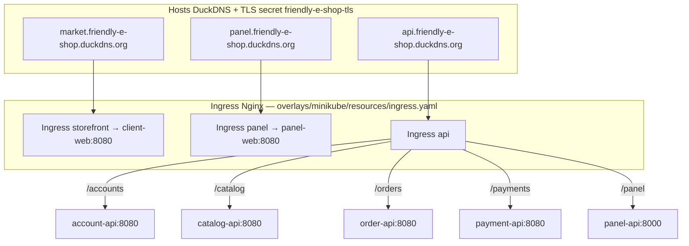
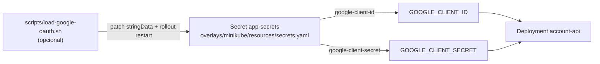
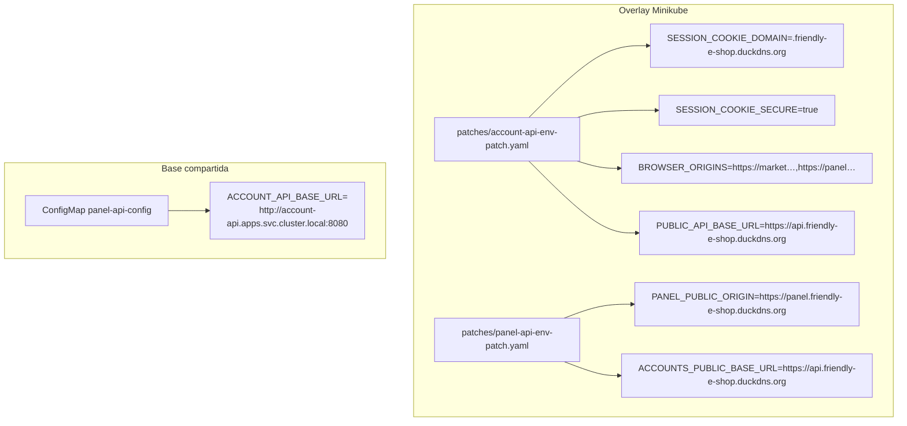
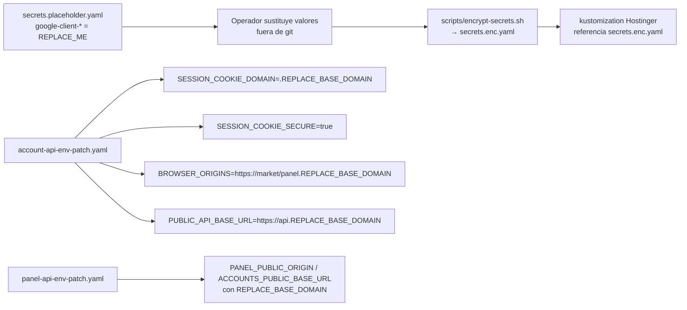

# UML 001 — Publicar cuentas y el secreto de Google

Diagrama del despliegue **real** en la rama `001/feat-publish-google-session`: plano público Minikube con DuckDNS + TLS, Ingress `/accounts`, secretos Google y env por overlay.

## Plano público Minikube (DuckDNS + TLS)

Nota: el Ingress usa **`market.*`** (no `shop.*`) para la tienda. Grafana local sigue en `grafana.friendly-e-shop.test` (HTTP, Ingress `local-tools`).

## Secretos Google → env de account-api

## Env por overlay — account-api y panel-api

## Hostinger — REPLACE_BASE_DOMAIN + SOPS

## Rutas de manifiestos (Minikube)

| Recurso | Ruta real |
|---|---|
| Ingress | `kubernetes/overlays/minikube/resources/ingress.yaml` |
| Secretos | `kubernetes/overlays/minikube/resources/secrets.yaml` |
| Env account-api | `kubernetes/overlays/minikube/patches/account-api-env-patch.yaml` |
| Env panel-api | `kubernetes/overlays/minikube/patches/panel-api-env-patch.yaml` |
| OAuth opcional | `scripts/load-google-oauth.sh` |

No existen `overlays/minikube/ingress.yaml` ni `overlays/minikube/secrets.yaml` en la raíz del overlay; viven bajo `resources/`.
