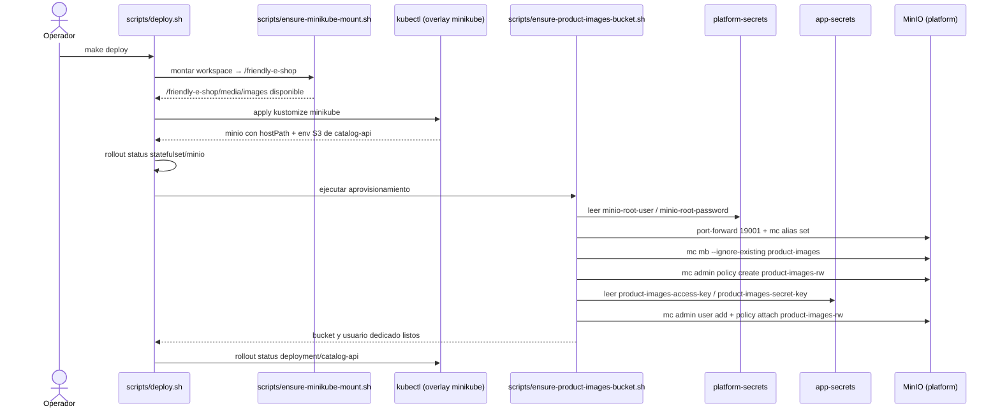
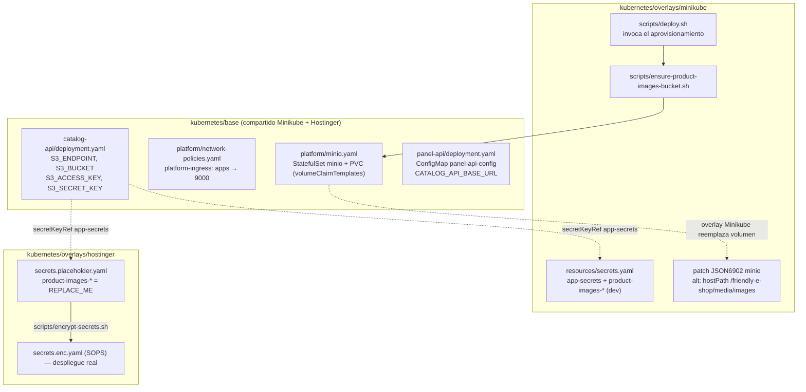
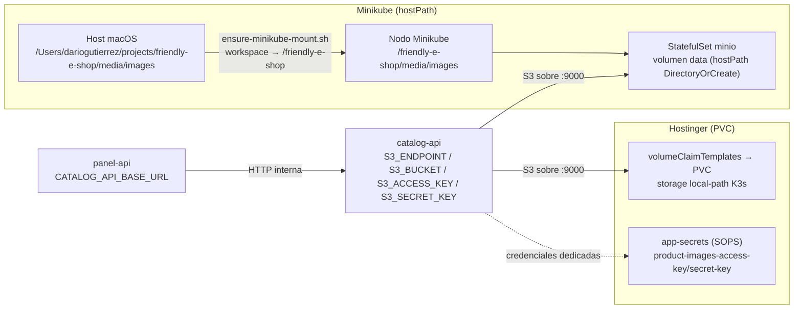
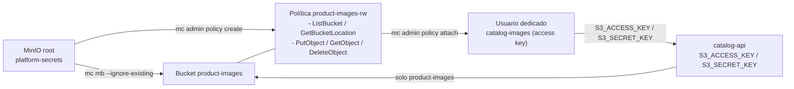

# UML 002 — Almacenamiento de imágenes de producto en MinIO y cableado

Diagramas del despliegue descrito por `plan.md` y `tasks.md` para `infra`: aprovisionamiento idempotente del bucket y las credenciales dedicadas, respaldo local del volumen de MinIO en Minikube y cableado S3 de catalog-api / panel-api.

Los diagramas muestran relaciones operativas relevantes del despliegue y omiten dependencias transitivas o detalles repetidos cuando ya están explicados por un recurso dueño, overlay o manifiesto principal.

## Secuencia — `make deploy` aprovisiona el bucket y las credenciales

Nota: el script usa las credenciales raíz solo para administración vía port-forward, nunca dentro de la aplicación. Si las claves dedicadas no existen en `app-secrets`, no inventa valores.

## Estructura — base compartida y overlays

## Datos — respaldo del volumen de MinIO por entorno

## Flujo de la política dedicada en MinIO

## Rutas de archivos

| Recurso | Ruta |
|---|---|
| Volumen MinIO (base) | `kubernetes/base/platform/minio.yaml` |
| NetworkPolicy | `kubernetes/base/platform/network-policies.yaml` |
| Env S3 catalog-api | `kubernetes/base/catalog-api/deployment.yaml` |
| ConfigMap panel-api | `kubernetes/base/panel-api/deployment.yaml` |
| Patch hostPath Minio (Minikube) | `kubernetes/overlays/minikube/kustomization.yaml` |
| Secretos Minikube | `kubernetes/overlays/minikube/resources/secrets.yaml` |
| Secretos Hostinger | `kubernetes/overlays/hostinger/secrets.placeholder.yaml` → `secrets.enc.yaml` |
| Aprovisionamiento idempotente | `scripts/ensure-product-images-bucket.sh` |
| Invocación | `scripts/deploy.sh` |
| Documentación manual | `docs/product-images.md` |

No hay cambios de Terraform en este corte: PVC y secretos viven en Kustomize. Si un cambio futuro lo requiriera, se respetarían `/terraform-style-guide` y `/terraform-module-library`.
