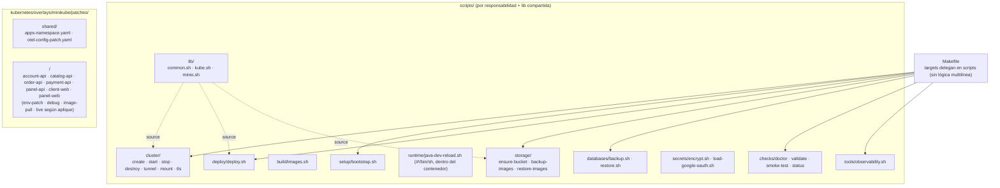
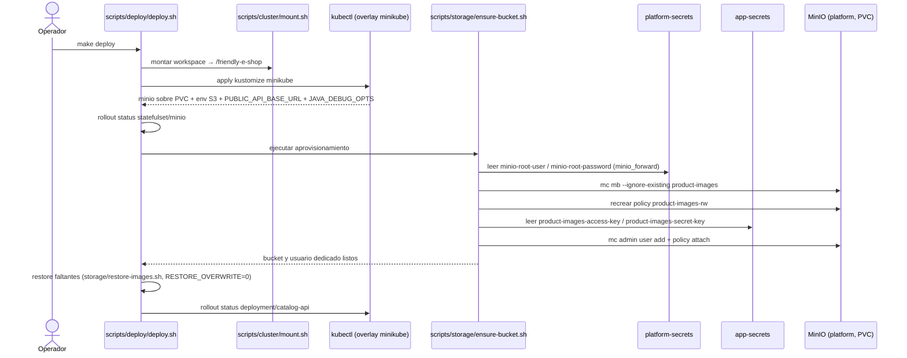
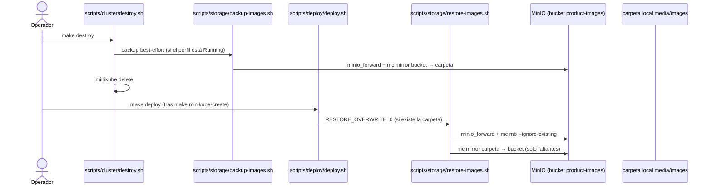
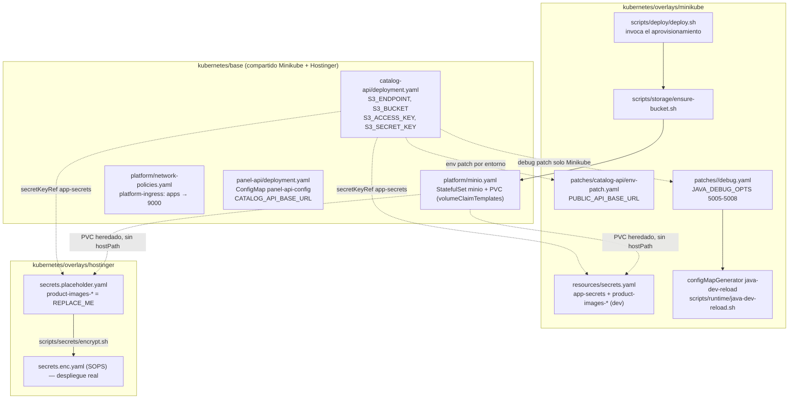
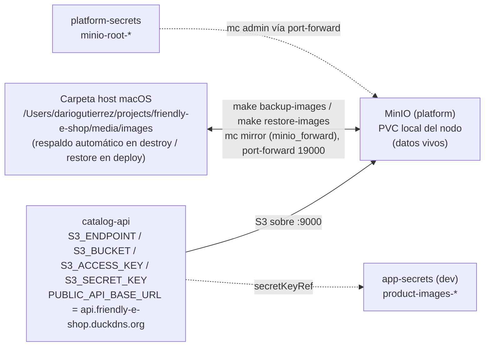
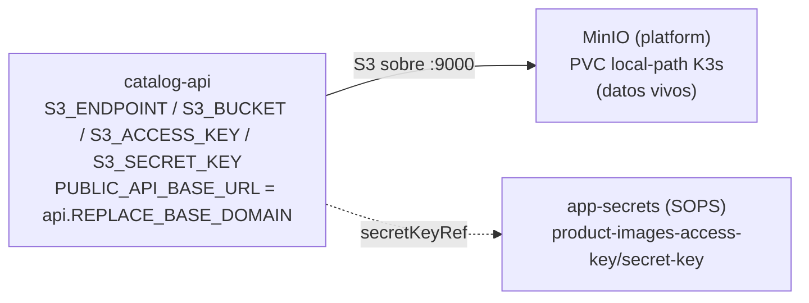
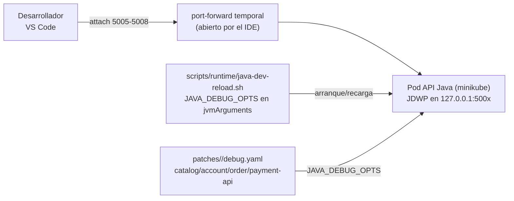
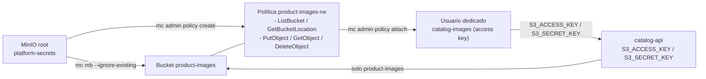

# UML 002 — Almacenamiento de imágenes de producto en MinIO y cableado

Diagramas del despliegue **as-built** descrito por `plan.md` y `tasks.md` para `infra`: aprovisionamiento idempotente del bucket y las credenciales dedicadas, MinIO sobre PVC con respaldo/restauración automatizados, cableado S3 de catalog-api / panel-api, depuración local JDWP en Minikube y convenciones de estructura de scripts y parches.

Los diagramas muestran relaciones operativas relevantes del despliegue y omiten dependencias transitivas o detalles repetidos cuando ya están explicados por un recurso dueño, overlay o manifiesto principal.

## Estructura — scripts y parches (convenciones)

La skill `k8s-custom-good-practices` documenta estas reglas. No existe la carpeta `patches/live/`: los parches de recarga local viven dentro de la carpeta de su proyecto.

## Secuencia — `make deploy` aprovisiona el bucket y las credenciales

Nota: MinIO conserva su `volumeClaimTemplates` (PVC) en Minikube y Hostinger; el overlay Minikube **no** parchea el volumen a `hostPath`. La librería `scripts/lib/minio.sh` abre el port-forward con credenciales raíz solo para administración, nunca dentro de la aplicación. Si las claves dedicadas no existen en `app-secrets`, no inventa valores.

## Secuencia — respaldo y restauración automatizados (Minikube)

## Estructura — base compartida y overlays

## Entorno Minikube — datos y respaldo

MinIO no puede usar el `hostPath` del workspace como backend vivo: `minikube mount` lo expone como `9p` y el backend erasure de MinIO falla con `Rename across devices not allowed`. Por eso el PVC es el almacenamiento vivo y la carpeta local es solo destino de copia.

## Entorno Hostinger — datos

Hostinger no usa la carpeta local de macOS ni los overlays de debug: las imágenes permanecen en el PVC y las credenciales dedicadas llegan por el secret cifrado.

## Depuración local JDWP (solo Minikube)

El overlay Hostinger no incluye los patches `*/debug.yaml`, así que el depurador queda deshabilitado. El agente escucha en `127.0.0.1` dentro del pod y solo se alcanza por port-forward.

## Flujo de la política dedicada en MinIO

## Rutas de archivos

| Recurso | Ruta |
|---|---|
| Volumen MinIO (base, PVC) | `kubernetes/base/platform/minio.yaml` |
| NetworkPolicy | `kubernetes/base/platform/network-policies.yaml` |
| Env S3 catalog-api | `kubernetes/base/catalog-api/deployment.yaml` |
| ConfigMap panel-api | `kubernetes/base/panel-api/deployment.yaml` |
| URL pública por entorno | `kubernetes/overlays/minikube/patches/catalog-api/env-patch.yaml`, `kubernetes/overlays/hostinger/catalog-api-env-patch.yaml` |
| Parche transversal de namespace | `kubernetes/overlays/minikube/patches/shared/apps-namespace.yaml` |
| Depuración JDWP (Minikube) | `kubernetes/overlays/minikube/patches/{catalog-api,account-api,order-api,payment-api}/debug.yaml` |
| Recarga Java + `JAVA_DEBUG_OPTS` | `scripts/runtime/java-dev-reload.sh` |
| Secretos Minikube | `kubernetes/overlays/minikube/resources/secrets.yaml` |
| Secretos Hostinger | `kubernetes/overlays/hostinger/secrets.placeholder.yaml` → `secrets.enc.yaml` |
| Aprovisionamiento idempotente | `scripts/storage/ensure-bucket.sh` |
| Respaldo / restauración | `scripts/storage/backup-images.sh`, `scripts/storage/restore-images.sh` |
| Invocación en deploy / destroy | `scripts/deploy/deploy.sh`, `scripts/cluster/destroy.sh` |
| Librería compartida | `scripts/lib/common.sh`, `scripts/lib/kube.sh`, `scripts/lib/minio.sh` |
| Documentación manual | `docs/product-images.md` (y `README.md` para debugging), `scripts/README.md` |

No hay cambios de Terraform en este corte: PVC y secretos viven en Kustomize. Si un cambio futuro lo requiriera, se respetarían `/terraform-style-guide` y `/terraform-module-library`.
