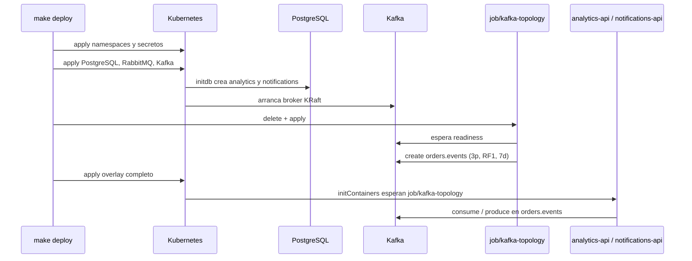
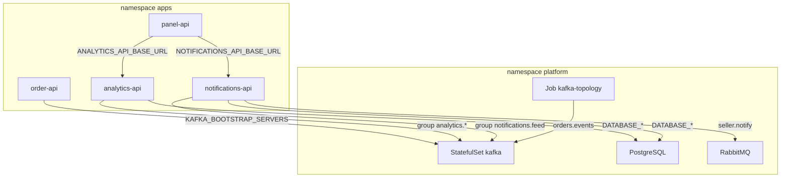

# UML 005 — Kafka KRaft y despliegue de analítica y notificaciones

## Flujo de arranque

```mermaid
sequenceDiagram
  participant Deploy as make deploy
  participant K8s as Kubernetes
  participant PG as PostgreSQL
  participant K as Kafka
  participant Job as job/kafka-topology
  participant App as analytics-api / notifications-api

  Deploy->>K8s: apply namespaces y secretos
  Deploy->>K8s: apply PostgreSQL, RabbitMQ, Kafka
  K8s->>PG: initdb crea analytics y notifications
  K8s->>K: arranca broker KRaft
  Deploy->>Job: delete + apply
  Job->>K: espera readiness
  Job->>K: create orders.events (3p, RF1, 7d)
  Deploy->>K8s: apply overlay completo
  K8s->>App: initContainers esperan job/kafka-topology
  App->>K: consume / produce en orders.events
```

## Estructura

```mermaid
flowchart TB
  subgraph platform[namespace platform]
    Kafka[StatefulSet kafka]
    Topology[Job kafka-topology]
    PG[PostgreSQL]
    Rabbit[RabbitMQ]
  end
  subgraph apps[namespace apps]
    Order[order-api]
    Analytics[analytics-api]
    Notifications[notifications-api]
    Panel[panel-api]
  end
  Order -->|KAFKA_BOOTSTRAP_SERVERS| Kafka
  Analytics -->|group analytics.*| Kafka
  Notifications -->|group notifications.feed| Kafka
  Notifications -->|seller.notify| Rabbit
  Analytics -->|DATABASE_*| PG
  Notifications -->|DATABASE_*| PG
  Panel -->|ANALYTICS_API_BASE_URL| Analytics
  Panel -->|NOTIFICATIONS_API_BASE_URL| Notifications
  Topology -->|orders.events| Kafka
```
